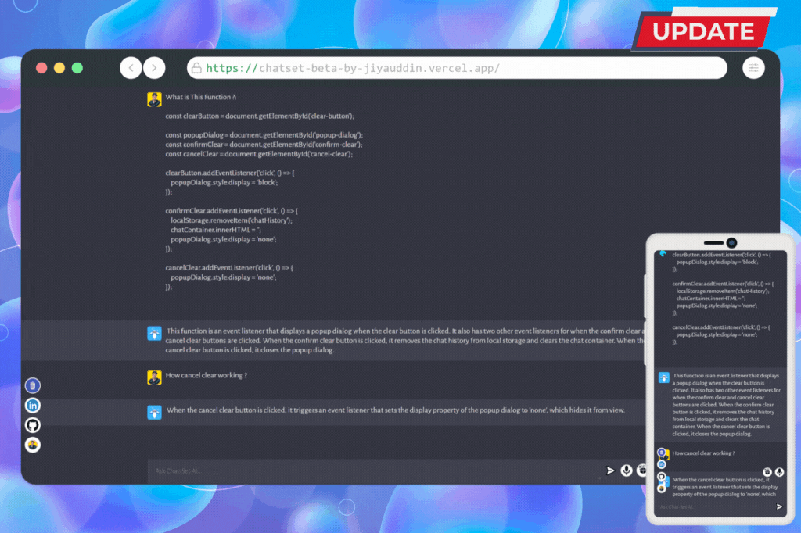

# ChatSet Ai



ChatSet Ai is a AI chatbot application that allows users to communicate with an artificial intelligence program. This application was created by Jiyauddin Saiyad.

# Demo 👉🏻 [ChatSet-Beta](https://chatset-beta-by-jiyauddin.vercel.app/)

# Updates 
## All Updates are added 

- [x] Voice Typing
- [x] Surprise Me
- [x] Improved UI for Mobile Devices
- [x] Updated Documentation
- [x] Fixed Prompt Error
- [x] Adjusted Chat Box for Mobile Compatibility
- [x] Saved Past Conversations 
- [x] Created Function to Continue Chat from Previous Messages 

## Getting Started

To use ChatSet Ai, follow these steps:

1. Open the HTML file in a web browser or run the development server using the following command:
 ```command 
npm run dev
```
2. Start the server by running the following command: 
 ```command 
 npm run server
 ```
3. Set up the necessary environment variables. This code uses dotenv to manage environment variables, so you will need to create a .env file in the server directory with the following variables:
   - `OPENAI_API_KEY`: Your API key for the [OpenAI](http://openapi.com/api) API. You will need to sign up for an API key to use the ChatSet.

## Dependencies

This application uses the following dependencies:

- HTML
- CSS
- JavaScript

It also uses the following dev dependencies:

- Vite

On the server side, it uses the following dependencies:
- Express
- CORS
- dotenv
- nodemon
- [OpenAI](http://openapi.com/api)

## Usage

To use the ChatSet, type a question or statement into the text area and click the send button or press the enter key. The ChatSet will respond with an answer or follow-up question.

## Building and Previewing

To build the application for production, run the following command: 
```command 
npm run build
```
To preview the production build, run the following command: 
```command 
npm run preview
```

## Additional Features

- This code includes the following additional features:

- Artificial intelligence chatbot: ChatSet Ai allows users to communicate with an artificial intelligence program through a chat interface.

- HTML, CSS, and JavaScript: The application uses HTML, CSS, and JavaScript for the front-end interface.

- Development dependencies: ChatSet Ai uses the Vite dev dependency for building and previewing the application.

- Server-side dependencies: On the server side, the application uses the following dependencies: Express, CORS, dotenv, nodemon, and OpenAI.

- Chat functionality: Users can type in questions or statements and the ChatSet will respond with an answer or follow-up question.

- Loading screen and indicator: There is a loading screen that displays while the ChatSet is processing a response, as well as a loading indicator in the chat window.

- Unique ID generation: ChatSet Ai includes a function to generate a unique ID for each chat stripe.

- Typing function: There is a function that types out the ChatSet's response in the chat window.

- Server functionality: The server code handles requests from the ChatSet client and communicates with the OpenAI API to generate responses. It includes a GET route that returns a simple message and a POST route that takes a user's prompt as a request body and sends it to the OpenAI API to generate a response.

- Contributing: The project owner, Jiyauddin Saiyad, is available for contributions via LinkedIn, GitHub, or their portfolio.

## Server Functionality

The server code is responsible for handling requests from the ChatSet client and communicating with the [OpenAI API](http://openapi.com/api) to generate responses. It includes the following functionality:

- A GET route that returns a simple message
- A POST route that takes a user's prompt as a request body and sends it to the [OpenAI API](http://openapi.com/api) to generate a response. The response is then sent back to the client.

## Area of Improvements

- Enhanced conversation capabilities: The chatbot's conversation capabilities could be improved by incorporating more advanced natural language processing techniques and a larger and more diverse training dataset.

- User experience improvements: The user interface and user experience of the chatbot could be enhanced with more intuitive navigation and design elements.

- Integration with additional services: ChatSet Ai could be integrated with additional services or APIs to expand its functionality and capabilities.

- Security enhancements: The application could be made more secure by implementing additional measures such as encryption and authentication.

- Improved scalability: The application could be designed to handle a larger number of users and requests more efficiently by implementing techniques such as load balancing and caching.

- Increased automation: Automation of certain processes and tasks could be implemented to improve efficiency and reduce the workload on the development team.

- Improved error handling: The application could be enhanced to more effectively handle and recover from errors and exceptions.

- Enhanced documentation: Detailed documentation of the application's code and functionality could be provided to facilitate understanding and maintenance.

- Additional features: New features and functionality could be added to the application to make it more useful and useful for users.

- Performance optimization: The application could be optimized for better performance by implementing techniques such as code optimization and efficient data management.

## Contributing

To contribute to this project, please contact Jiyauddin Saiyad via [LinkedIn](https://www.linkedin.com/in/jiyauddin-saiyad/) or [GitHub](https://github.com/JiyauddinSaiyad) or [PortFolio.](https://jiyauddinsaiyad.github.io/) 

## License

This project is licensed under the [MIT License](https://github.com/JiyauddinSaiyad/chatSet/blob/main/LICENSE).


